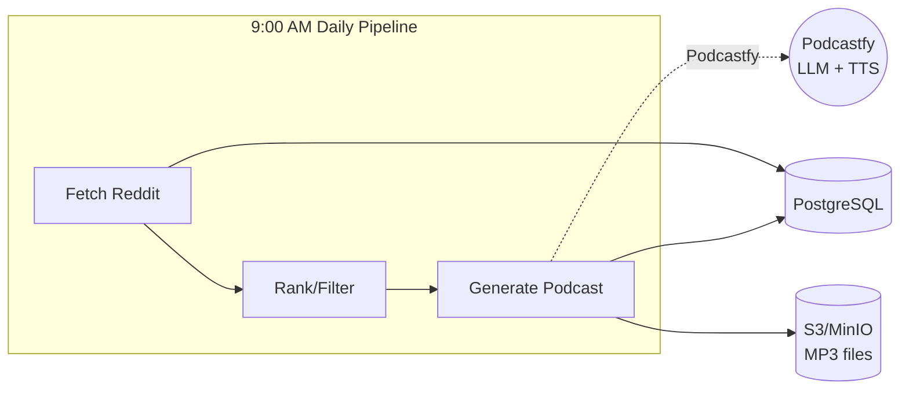
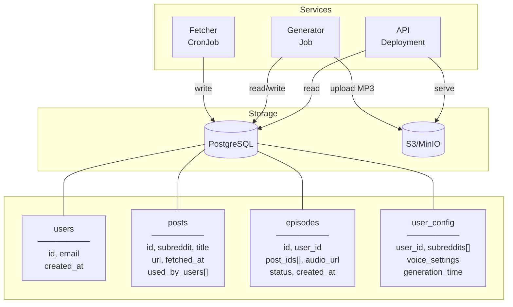
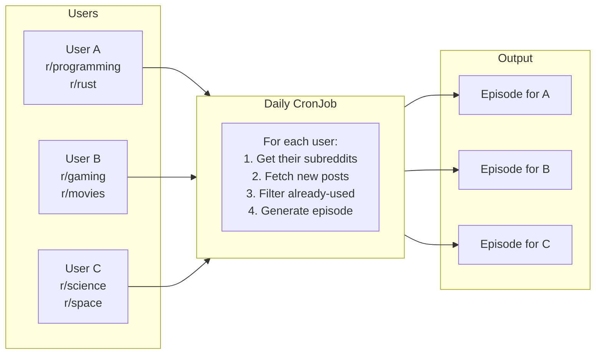
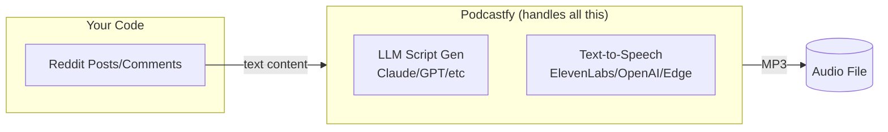
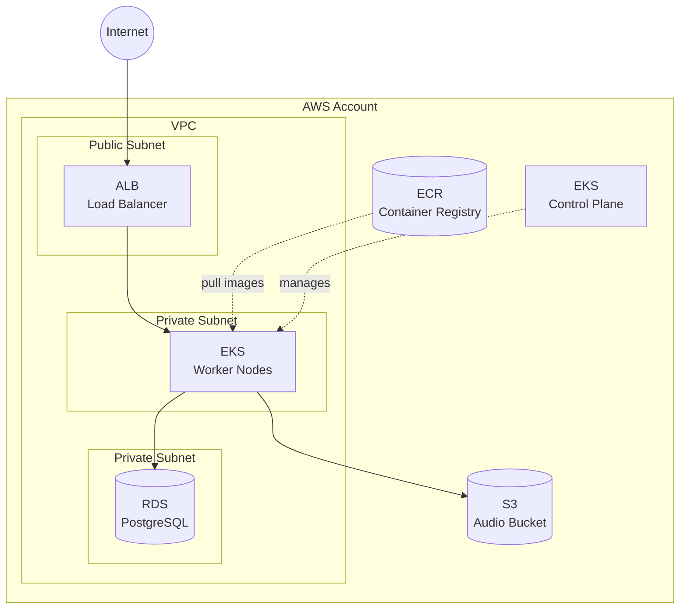
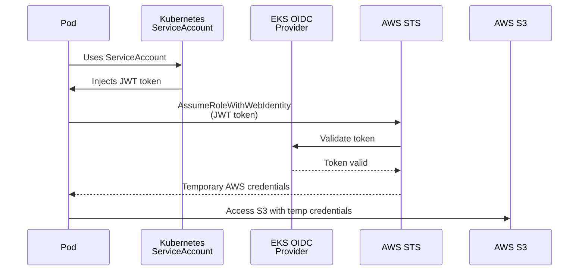
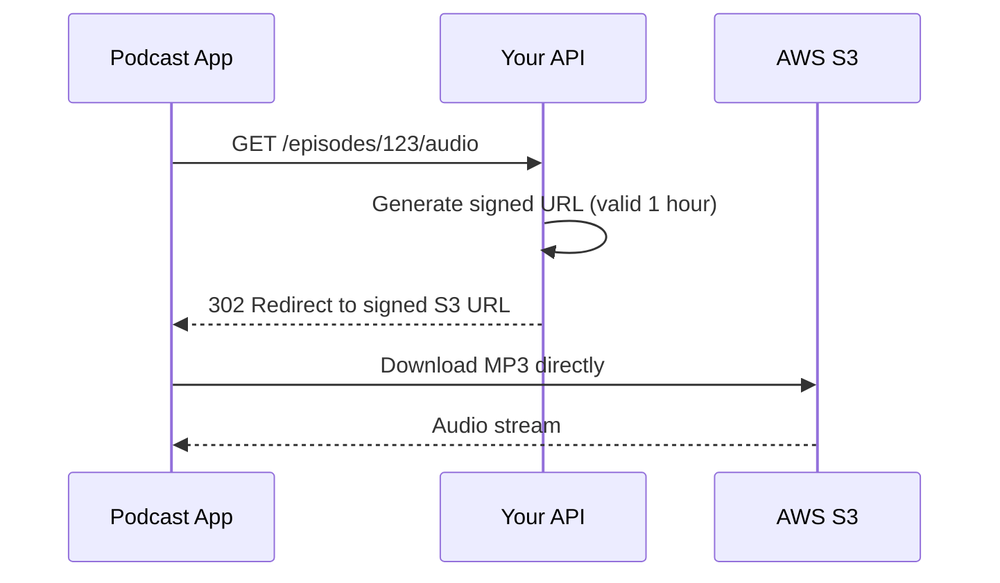
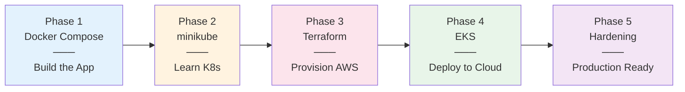
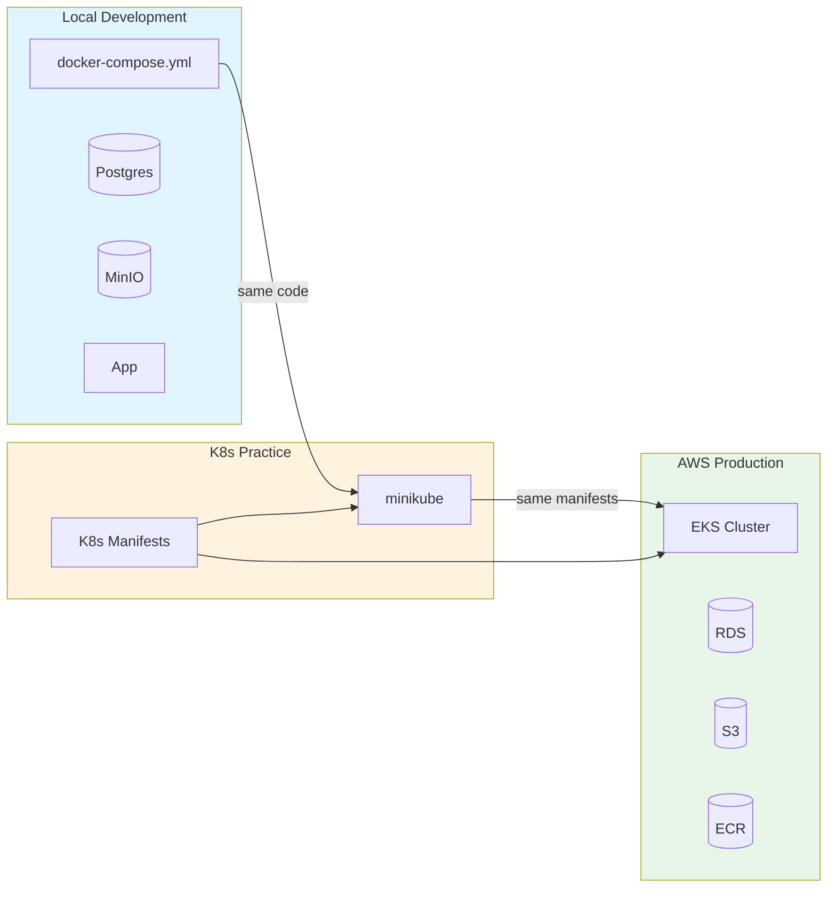

# Reddit Podcast Generator - Project Plan

Title of app: "Your Podcast"

A personal project to generate daily podcasts from Reddit content, designed for learning Kubernetes and backend architecture.

---

## Table of Contents

1. [Project Overview](#project-overview)
2. [Architecture](#architecture)
3. [Services Breakdown](#services-breakdown)
4. [Tech Stack](#tech-stack)
5. [Project Structure](#project-structure)
6. [Local Development Setup](#local-development-setup)
7. [Container Management](#container-management)
8. [AWS Deployment Path](#aws-deployment-path)
9. [Kubernetes Concepts to Learn](#kubernetes-concepts-to-learn)
10. [Learning Progression](#learning-progression)
11. [Tools to Install](#tools-to-install)
12. [Key Decisions Made](#key-decisions-made)

---

## Project Overview

### The Problem

Hour-long commutes with nothing engaging to listen to.

### The Solution

An automated system that:

1. Fetches posts/comments from followed subreddits via Reddit API
2. Uses Podcastfy to generate engaging conversational audio
3. Tracks what's been discussed to avoid repetition
4. Delivers a fresh podcast every morning at 9am

### External Services (SaaS)

- **Claude/OpenAI** - Script generation (via Podcastfy)
- **ElevenLabs** - Text-to-speech (via Podcastfy)

Everything else is self-hosted/managed.

---

## Architecture

### High-Level Flow



**Timeline:** 9:00 AM start → ~9:10 AM episode ready

### Data Flow Diagram



### Multi-User Architecture

Each user gets their own personalized podcast based on their subreddit preferences.



#### Key Concepts

| Concept                | Description                                             |
| ---------------------- | ------------------------------------------------------- |
| **User isolation**     | Each user's episodes are private to them                |
| **Per-user config**    | Subreddits, voice preferences, generation time          |
| **Post deduplication** | Track which posts each user has "heard" (not global)    |
| **S3 path convention** | `s3://bucket/users/{user_id}/episodes/{episode_id}.mp3` |

#### Authentication Options

| Option                | Complexity | Notes                                 |
| --------------------- | ---------- | ------------------------------------- |
| API keys              | Simple     | Generate key per user, pass in header |
| JWT tokens            | Medium     | Stateless, good for mobile apps       |
| OAuth (Google/GitHub) | Higher     | Better UX, no password management     |
| Cognito/Auth0         | Managed    | Offload auth entirely                 |

For a personal project, start with simple API keys. Graduate to OAuth if you want to share it.

---

## Services Breakdown

### Two Services (Final Decision)

| Service         | K8s Type   | Responsibility                                              |
| --------------- | ---------- | ----------------------------------------------------------- |
| `daily-podcast` | CronJob    | Fetch Reddit → Filter → Generate audio via Podcastfy → Save |
| `api`           | Deployment | Serve RSS feed, stream MP3 files                            |

### Why Two Services (Not Three)

Originally considered splitting Fetcher and Generator, but since everything runs once daily in sequence, a single CronJob is simpler and still teaches the key K8s concepts.

### Service Details

#### 1. daily-podcast (CronJob)

- **Schedule:** 9am daily (or 8:30am for buffer)
- **Steps:** Fetch Reddit → Filter used posts → Rank content → Call Podcastfy → Upload MP3 → Update DB
- **Runtime:** 5-15 minutes depending on episode length

#### 2. api (Deployment)

- **Always Running:** Yes
- **Endpoints:** RSS feed, audio streaming, episode list

---

## Tech Stack

### Application Layer

| Component          | Technology                                                 | Notes                             |
| ------------------ | ---------------------------------------------------------- | --------------------------------- |
| Language           | Python                                                     | Required for Podcastfy            |
| Podcast Generation | **[Podcastfy](https://github.com/souzatharsis/podcastfy)** | Handles script + audio generation |
| Reddit Client      | PRAW                                                       | Reddit API wrapper                |
| Database ORM       | SQLAlchemy                                                 | DB interactions                   |
| S3 Client          | boto3                                                      | Works with MinIO locally          |

### Podcastfy - The Secret Weapon

Podcastfy is an open-source library that handles the entire content → conversational script → audio pipeline. It's essentially an open-source NotebookLM.



**Why Podcastfy:**

- Handles conversational script generation (two hosts discussing content)
- Supports multiple TTS backends (ElevenLabs, OpenAI, Google, Edge)
- Customizable conversation style, voices, languages
- One library call instead of managing LLM + TTS separately

### Infrastructure Layer

| Component              | Local              | AWS       |
| ---------------------- | ------------------ | --------- |
| Database               | Postgres container | RDS       |
| Object Storage         | MinIO container    | S3        |
| Container Registry     | minikube internal  | ECR       |
| Kubernetes             | minikube           | EKS       |
| Infrastructure as Code | -                  | Terraform |

### External APIs

| Service       | Purpose                           | Cost Model            |
| ------------- | --------------------------------- | --------------------- |
| Claude/OpenAI | Script generation (via Podcastfy) | Per token             |
| ElevenLabs    | Text-to-speech (via Podcastfy)    | Per character         |
| Reddit        | Content source                    | Free with rate limits |

---

## Project Structure

```
reddit-podcast/
├── src/
│   ├── fetcher/           # Reddit fetching + filtering
│   ├── generator/         # Podcastfy wrapper
│   ├── api/               # RSS feed & serving
│   └── db/                # Database models
├── Dockerfile
├── docker-compose.yml     # Local development
├── podcastfy_config.yaml  # Conversation settings
└── infra/
    ├── terraform/         # AWS infrastructure
    └── k8s/
        ├── base/          # Kustomize base manifests
        └── overlays/
            ├── local/     # minikube overrides
            └── prod/      # EKS overrides
```

---

## Local Development Setup

### Philosophy

Run everything locally with Docker Compose. No cloud dependencies for daily development. Same code works locally and in production - only configuration differs.

### Local Stack Components

| Service  | Image              | Purpose               |
| -------- | ------------------ | --------------------- |
| postgres | postgres:16-alpine | Database              |
| minio    | minio/minio        | S3-compatible storage |
| app      | Your Dockerfile    | Application           |

### Environment Variables Needed

- `DATABASE_URL` - Postgres connection string
- `S3_ENDPOINT` - MinIO endpoint (local) or omit for real S3
- `S3_BUCKET` - Bucket name for audio files
- `OPENAI_API_KEY` or `ANTHROPIC_API_KEY` - For Podcastfy LLM
- `ELEVENLABS_API_KEY` - For Podcastfy TTS
- `REDDIT_CLIENT_ID` / `REDDIT_CLIENT_SECRET` - Reddit API

---

## Container Management

### The Problem

Don't want container images publicly accessible.

### Solution: Private Container Registries

| Registry                            | Best For              | Notes                  |
| ----------------------------------- | --------------------- | ---------------------- |
| Docker Hub                          | Simple projects       | 1 free private repo    |
| GitHub Container Registry (ghcr.io) | GitHub-based projects | Free private repos     |
| AWS ECR                             | AWS deployments       | Native EKS integration |

### Key Concepts

- **Local dev (minikube):** Build directly into minikube's Docker daemon - no registry needed
- **AWS ECR:** Authenticate Docker to ECR, tag images with ECR URL, push
- **Image Pull Secrets:** K8s needs credentials to pull from private registries

---

## AWS Deployment Path

### Infrastructure Components



### EKS-Specific Concepts

| Concept        | What It Is                          | Why It Matters                              |
| -------------- | ----------------------------------- | ------------------------------------------- |
| OIDC Provider  | Identity bridge between EKS and IAM | Lets pods assume IAM roles                  |
| IRSA           | IAM Roles for Service Accounts      | Pods can access S3, Secrets Manager, etc.   |
| VPC CNI        | AWS networking plugin               | How pods get IPs                            |
| ALB Controller | Ingress implementation              | Creates AWS load balancers from K8s Ingress |
| EBS CSI Driver | Storage plugin                      | PersistentVolumes backed by EBS             |

---

### IRSA Deep Dive (IAM Roles for Service Accounts)

IRSA is the secure way to give your pods AWS permissions. Instead of hardcoding credentials, pods automatically get temporary credentials by assuming an IAM role.

#### Why IRSA Matters

| Approach                   | Security | Rotation      | Blast Radius                     |
| -------------------------- | -------- | ------------- | -------------------------------- |
| Hardcoded keys in env vars | Bad      | Manual        | All pods with the key            |
| K8s Secret with AWS keys   | Better   | Manual        | Pods that mount the secret       |
| **IRSA**                   | **Best** | **Automatic** | **Only specific ServiceAccount** |

#### How IRSA Works



#### Your Use Case

Your podcast generator needs:

- **S3 access** - Upload/download MP3 files
- **Secrets Manager** (optional) - Store API keys securely

With IRSA, your pod automatically gets these permissions without any credentials in your code.

---

### S3 Signed URLs

Signed URLs let you grant temporary access to private S3 objects without making them public or proxying through your API.

#### Why Use Signed URLs

| Approach          | Pros                  | Cons                                    |
| ----------------- | --------------------- | --------------------------------------- |
| Public S3 bucket  | Simple                | Anyone can access all files             |
| Proxy through API | Full control          | API becomes bottleneck, bandwidth costs |
| **Signed URLs**   | **Secure + scalable** | **Client downloads directly from S3**   |

#### How It Works



#### Key Concepts

- **Expiration** - URLs expire after a set time (e.g., 1 hour)
- **Permissions** - URL inherits permissions from the IAM role that generated it
- **No proxying** - Client downloads directly from S3, saving your API bandwidth
- **Private bucket** - Bucket stays private, only signed URLs grant access

#### Your Use Case

1. API receives request for episode audio
2. API generates signed URL for the S3 object (using IRSA credentials)
3. API redirects client to signed URL
4. Client downloads directly from S3
5. URL expires after 1 hour - no permanent access

#### IRSA Setup Summary

1. EKS creates an OIDC provider automatically
2. Create IAM policy with least-privilege permissions (S3 access)
3. Create IAM role with trust policy for your specific K8s ServiceAccount
4. Annotate K8s ServiceAccount with the IAM role ARN
5. Use that ServiceAccount in your pod spec
6. AWS SDK automatically discovers and uses the credentials

#### IRSA Learning Checklist

- [ ] Understand what an OIDC provider is
- [ ] Create IAM policy with least-privilege permissions
- [ ] Create IAM role with trust policy for specific ServiceAccount
- [ ] Annotate K8s ServiceAccount with role ARN
- [ ] Use the ServiceAccount in your pod spec
- [ ] Verify credentials are injected into pod
- [ ] Test S3 access from within the pod

---

### Cost Considerations

| Component                 | Approximate Cost |
| ------------------------- | ---------------- |
| EKS Control Plane         | ~$70/month       |
| EC2 Nodes (t3.medium x 2) | ~$60/month       |
| RDS (db.t3.micro)         | ~$15/month       |
| S3                        | < $1/month       |
| NAT Gateway               | ~$30/month       |
| **Total**                 | **~$175/month**  |

**Cost reduction options:** Fargate (pay per pod), single NAT Gateway, smaller RDS, spot instances

---

## Kubernetes Concepts to Learn

### Core Concepts (Phase 1)

| Concept        | Description                                      | Your Use Case                |
| -------------- | ------------------------------------------------ | ---------------------------- |
| **Pod**        | Smallest deployable unit, one or more containers | Your app containers          |
| **Deployment** | Manages ReplicaSets, rolling updates             | API service                  |
| **Service**    | Stable network endpoint for pods                 | Internal communication       |
| **ConfigMap**  | Non-sensitive configuration                      | Subreddit list, app settings |
| **Secret**     | Sensitive configuration                          | API keys                     |
| **Namespace**  | Virtual cluster isolation                        | Separate envs                |

### Jobs & Scheduling (Phase 2)

| Concept     | Description                | Your Use Case                |
| ----------- | -------------------------- | ---------------------------- |
| **Job**     | Run-to-completion workload | One-off podcast generation   |
| **CronJob** | Scheduled Job              | Daily 9am podcast generation |

### Storage (Phase 3)

| Concept                         | Description              | Your Use Case           |
| ------------------------------- | ------------------------ | ----------------------- |
| **PersistentVolume (PV)**       | Cluster storage resource | Database storage        |
| **PersistentVolumeClaim (PVC)** | Request for storage      | Postgres data directory |
| **StorageClass**                | Defines storage types    | gp2, gp3 on AWS         |

### Networking (Phase 4)

| Concept                | Description                     | Your Use Case       |
| ---------------------- | ------------------------------- | ------------------- |
| **Ingress**            | HTTP/HTTPS routing              | Expose podcast feed |
| **Ingress Controller** | Implements Ingress (ALB, nginx) | AWS ALB             |
| **NetworkPolicy**      | Pod-to-pod firewall rules       | Restrict DB access  |

### Production Patterns (Phase 5)

| Concept             | Description                 | Your Use Case          |
| ------------------- | --------------------------- | ---------------------- |
| **Helm**            | Package manager for K8s     | Bundle your manifests  |
| **Kustomize**       | Configuration customization | Local vs prod settings |
| **HPA**             | Horizontal Pod Autoscaler   | Scale API on demand    |
| **Resource Limits** | CPU/memory constraints      | Prevent runaway pods   |
| **Health Checks**   | Liveness/readiness probes   | Automated recovery     |

---

## Learning Progression



### Phase 1: Local Development (Docker Compose)

**Goal:** Working application without K8s complexity

- [ ] Set up project structure
- [ ] Implement Reddit fetcher with PRAW
- [ ] Integrate Podcastfy for audio generation
- [ ] Implement RSS feed API
- [ ] Test full pipeline locally with docker-compose

### Phase 2: Basic Kubernetes (minikube)

**Goal:** Same app running on K8s

- [ ] Install minikube, kubectl, k9s
- [ ] Write Deployment manifest for API
- [ ] Write CronJob manifest for generator
- [ ] Create ConfigMaps and Secrets
- [ ] Deploy Postgres as StatefulSet
- [ ] Get everything running on minikube

### Phase 3: Terraform AWS Infrastructure

**Goal:** AWS resources provisioned

- [ ] Set up Terraform project
- [ ] Create VPC and subnets
- [ ] Create ECR repository
- [ ] Create EKS cluster
- [ ] Create RDS Postgres instance
- [ ] Create S3 bucket
- [ ] Set up IAM roles and IRSA

### Phase 4: Deploy to EKS

**Goal:** Production deployment

- [ ] Push container to ECR
- [ ] Adapt manifests for EKS (Kustomize overlays)
- [ ] Configure ALB Ingress
- [ ] Configure RDS connection
- [ ] Configure S3 access via IRSA
- [ ] Deploy and test

### Phase 5: Production Hardening

**Goal:** Production-ready

- [ ] Add resource limits
- [ ] Add health checks (liveness/readiness probes)
- [ ] Set up monitoring (CloudWatch, Prometheus)
- [ ] Configure HTTPS/TLS
- [ ] Set up CI/CD pipeline

---

## Tools to Install

### Essential

| Tool      | Purpose                                  |
| --------- | ---------------------------------------- |
| docker    | Container runtime                        |
| kubectl   | Kubernetes CLI                           |
| minikube  | Local K8s cluster                        |
| k9s       | Terminal UI for K8s (highly recommended) |
| awscli    | AWS CLI                                  |
| terraform | Infrastructure as Code                   |
| helm      | K8s package manager                      |

### Helpful

| Tool     | Purpose                                 |
| -------- | --------------------------------------- |
| kompose  | Convert docker-compose to K8s manifests |
| kubectx  | K8s context/namespace switcher          |
| skaffold | Hot reload for K8s development          |
| eksctl   | EKS cluster management                  |

---

## Key Decisions Made

### Architecture Decisions

| Decision           | Choice            | Rationale                                            |
| ------------------ | ----------------- | ---------------------------------------------------- |
| Number of services | 2 (CronJob + API) | Daily batch job doesn't need event-driven complexity |
| Podcast generation | Podcastfy         | Handles LLM + TTS in one library                     |
| Database           | PostgreSQL        | Familiar, reliable, good K8s support                 |
| Object storage     | S3/MinIO          | S3-compatible API works locally and on AWS           |
| Local K8s          | minikube          | Simple, well-documented, good for learning           |
| Cloud provider     | AWS (EKS)         | Work uses AWS, skills directly applicable            |
| IaC                | Terraform         | Industry standard, works across clouds               |

### Development Workflow



### Trade-offs Accepted

1. **Compose + K8s manifests to maintain** - More files, but clear separation of concerns
2. **EKS over GKE** - Steeper learning curve, but directly applicable to work
3. **Two services not three** - Less "pure" microservices, but appropriate for the use case
4. **AWS costs ~$175/month** - Acceptable for learning; can optimize later

---

## Resources

### Kubernetes

- [Kubernetes Official Docs](https://kubernetes.io/docs/home/)
- [Kubernetes The Hard Way](https://github.com/kelseyhightower/kubernetes-the-hard-way)
- [k9s Documentation](https://k9scli.io/)

### AWS EKS

- [EKS Best Practices](https://aws.github.io/aws-eks-best-practices/)
- [terraform-aws-modules/eks](https://github.com/terraform-aws-modules/terraform-aws-eks)
- [EKS Workshop](https://www.eksworkshop.com/)

### Podcastfy

- [Podcastfy GitHub](https://github.com/souzatharsis/podcastfy)
- [Podcastfy Documentation](https://podcastfy.readthedocs.io/)

### Tools

- [Kustomize](https://kustomize.io/)
- [Helm](https://helm.sh/docs/)
- [Skaffold](https://skaffold.dev/)

---

_Document created: January 2025_
_For: Reddit Podcast Generator - K8s Learning Project_
